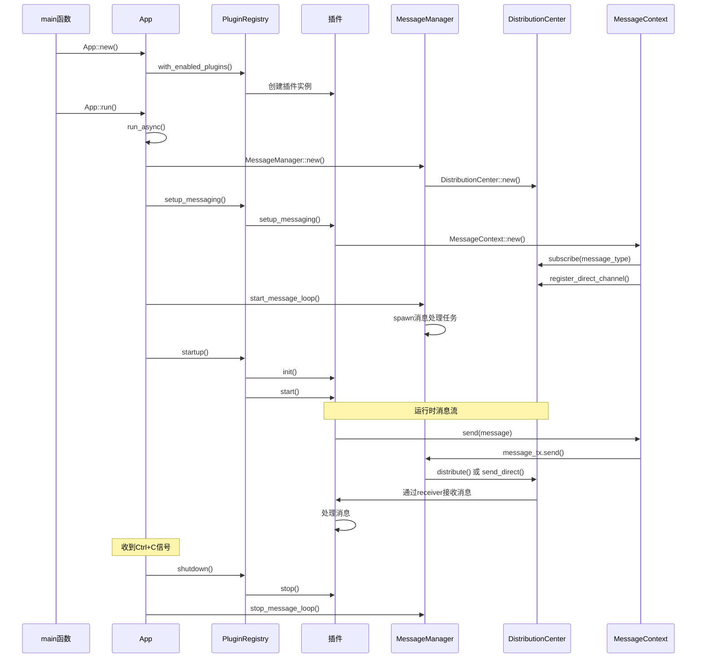
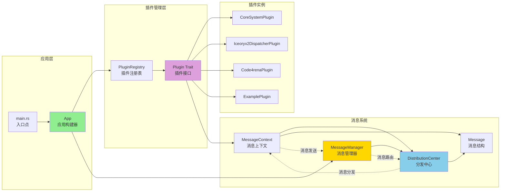
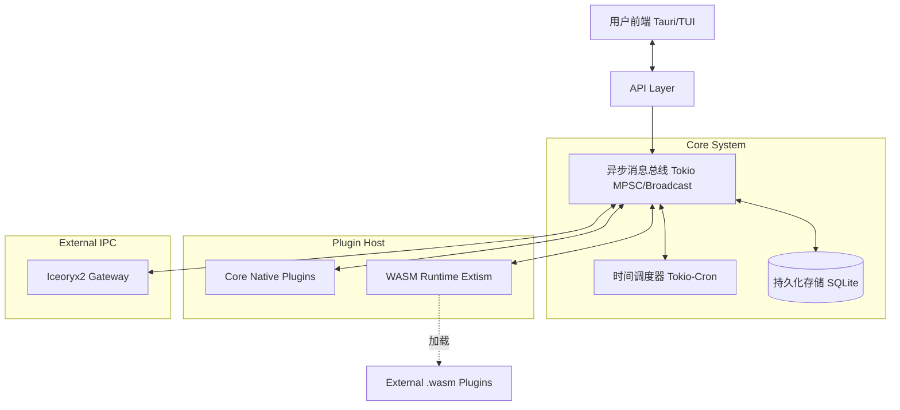

# Amadeus 架构文档

本文档详细说明 Amadeus 插件系统的架构设计、技术栈、通信机制和优化策略。

## 目录

- [系统架构](#系统架构)
- [通信机制](#通信机制)
- [函数调用链与流程图](#函数调用链与流程图)
- [技术栈](#技术栈)
- [代码优化](#代码优化)
- [文件结构](#文件结构)
- [项目路线图](#项目路线图-roadmap)
- [企业级集成](#企业级集成-enterprise-integration)

---

## 系统架构

### 整体架构图

Amadeus 采用**双模块设计**：核心（Message/Plugin Center）+ 插件（Plugins）。核心程序只负责“搭台”，即管理插件生命周期和消息分发，不再关心具体的业务或通信实现（如 IPC 通信），所有具体功能都下放给插件。

```
┌─────────────────────────────────────────────────────────────────┐
│                          Main Application                        │
│                            (main.rs)                             │
└──────────────────────────┬──────────────────────────────────────┘
                           │
                           │ 创建并管理
                           ▼
┌─────────────────────────────────────────────────────────────────┐
│                       PluginRegistry                             │
│                      (plugin.rs)                                 │
│                                                                  │
│  ┌────────────────────────────────────────────────────────┐    │
│  │  plugins: Vec<Box<dyn Plugin>>                         │    │
│  └────────────────────────────────────────────────────────┘    │
│                                                                  │
│  Methods:                                                        │
│  • register()      - 注册插件（按优先级排序）                    │
│  • init_all()      - 初始化所有插件                             │
│  • start_all()     - 启动所有插件                               │
│  • stop_all()      - 停止所有插件                               │
│  • startup()       - 执行 init -> start                         │
│  • shutdown()      - 执行 stop                                  │
└──────────────────┬──────────────────┬────────────────┬──────────┘
                   │                  │                │
                   │                  │                │
        ┌──────────┘                  │                └─────────┐
        │                             │                          │
        ▼                             ▼                          ▼
┌───────────────┐          ┌───────────────────┐     ┌────────────────┐
│ Iceoryx2 Disp │          │   Core System     │     │  Custom Plugin │
│  (Privileged) │          │     (Normal)      │     │    (Normal)    │
└───────────────┘          └───────────────────┘     └────────────────┘
        │                            │
        │ IPC                        │ Storage & Scheduler
        ▼                            ▼
   外部世界 (IPC)               SQLite / Cron
```

### 插件体系

插件分为两种类型（`PluginType`）：

1.  **特权插件 (Privileged)**：
    *   拥有更高优先级，并在普通插件之前加载。
    *   用于核心基础设施，如 IPC 分发器（`Iceoryx2DispatcherPlugin`）。
    *   为未来的权限管理和沙盒控制打下基础。
2.  **普通插件 (Normal)**：
    *   标准的业务逻辑插件（如 `CoreSystemPlugin`, `Code4renaPlugin`）。

### 消息系统架构

消息系统支持**广播（Public）**和**定向（Direct）**两种模式。

```
┌─────────────────────────────────────────────────────────┐
│                    外部系统/进程                          │
│              (前端、QQ bot、其他服务)                     │
└────────────────────┬────────────────────────────────────┘
                     │ Iceoryx2 (进程间通信)
                     │ 零拷贝 IPC
                     ▼
┌─────────────────────────────────────────────────────────┐
│          Iceoryx2DispatcherPlugin (特权插件)            │
│           (原 Dispatcher 模块，现已插件化)                │
└────────────────────┬────────────────────────────────────┘
                     │ 全局订阅 (Subscribe All) / 定向发送
                     ▼
┌─────────────────────────────────────────────────────────┐
│              MessageManager (消息管理器)                 │
│           (原 Message Center + Plugin Center)           │
└────────────────────┬────────────────────────────────────┘
                     │ Tokio Channels (进程内通信)
                     ▼
┌─────────────────────────────────────────────────────────┐
│          DistributionCenter (分发中心)                   │
│                                                         │
│  1. Broadcast Channels (Public Topic -> Subscribers)    │
│  2. Direct Channels (Plugin ID -> Specific Plugin)      │
│  3. Global Subscribers (All Public Messages)            │
└───────┬───────────────┬───────────────┬────────────────┘
        │               │               │
        ▼               ▼               ▼
    ┌───────┐      ┌───────┐      ┌───────┐
    │插件 A │      │插件 B │      │插件 C │
    └───────┘      └───────┘      └───────┘
```

---

## 通信机制

### 消息路由模式

1.  **Public 消息（广播）**
    *   **机制**：发布/订阅（Pub/Sub）。
    *   **流程**：插件 A 发送消息到 Topic `X` → 分发中心广播给所有订阅了 `X` 的插件。
    *   **用途**：系统事件、公共通知、解耦的业务逻辑。

2.  **Direct 消息（定向）**
    *   **机制**：点对点（P2P）。
    *   **流程**：插件 A 指定接收者 ID 发送消息 → 分发中心直接投递到目标插件的私有信道。
    *   **用途**：
        *   WASM 插件的安全沙盒通信。
        *   请求/响应模式。
        *   敏感数据传输（不希望被广播）。
    *   **启用**：插件需调用 `ctx.enable_direct_messaging()` 开启接收。

3.  **Global 订阅（全局监听）**
    *   **机制**：Wiretap。
    *   **用途**：分发器插件（如 `Iceoryx2Dispatcher`）需要监听所有内部公共消息并转发到外部 IPC。

---

## 函数调用链与流程图

### 函数调用链

Amadeus 系统的完整函数调用链如下：

```
main()
  └─> App::new()
      └─> PluginRegistry::with_enabled_plugins()
          └─> get_all_plugins()
              ├─> CoreSystemPlugin::new()
              ├─> Iceoryx2DispatcherPlugin::new()
              ├─> Code4renaPlugin::new()
              ├─> ExamplePlugin::new()
              └─> MessageExamplePlugin::new()
      └─> App::run()
          └─> App::run_async()
              ├─> PluginRegistry::list_plugins()
              ├─> PluginRegistry::export_metadata() [可选]
              ├─> App::with_messaging() [如果启用]
              │   └─> MessageManager::new()
              │       └─> DistributionCenter::new()
              ├─> PluginRegistry::setup_messaging()
              │   └─> Plugin::setup_messaging() [每个插件]
              │       └─> MessageContext::new()
              │           ├─> DistributionCenter::subscribe()
              │           └─> DistributionCenter::register_direct_channel()
              ├─> MessageManager::start_message_loop()
              │   └─> MessageManager::message_loop_task()
              │       ├─> DistributionCenter::send_direct() [定向消息]
              │       └─> DistributionCenter::distribute() [广播消息]
              ├─> PluginRegistry::startup()
              │   ├─> PluginRegistry::init_all()
              │   │   └─> Plugin::init() [每个插件]
              │   └─> PluginRegistry::start_all()
              │       └─> Plugin::start() [每个插件]
              ├─> tokio::signal::ctrl_c() [等待停止信号]
              ├─> PluginRegistry::shutdown()
              │   └─> PluginRegistry::stop_all()
              │       └─> Plugin::stop() [每个插件，逆序]
              └─> MessageManager::stop_message_loop()
```

### 系统架构流程图

```mermaid
graph TB
    Start([程序启动]) --> Main[main函数]
    Main --> AppNew[App::new<br/>创建应用实例]
    
    AppNew --> GetPlugins[get_all_plugins<br/>获取所有插件]
    GetPlugins --> CreatePlugins[创建插件实例<br/>CoreSystem/Iceoryx2/Code4rena等]
    CreatePlugins --> Registry[PluginRegistry<br/>注册插件并排序]
    
    Registry --> AppRun[App::run<br/>运行应用]
    AppRun --> RunAsync[App::run_async<br/>异步运行]
    
    RunAsync --> ListPlugins[列出已注册插件]
    ListPlugins --> CheckMessaging{是否启用<br/>消息系统?}
    
    CheckMessaging -->|是| CreateMsgMgr[MessageManager::new<br/>创建消息管理器]
    CheckMessaging -->|否| SetupPlugins[设置插件消息订阅]
    
    CreateMsgMgr --> CreateDC[DistributionCenter::new<br/>创建分发中心]
    CreateDC --> SetupPlugins
    
    SetupPlugins --> SetupMsg[PluginRegistry::setup_messaging<br/>为每个插件设置消息订阅]
    SetupMsg --> PluginSetup[Plugin::setup_messaging<br/>每个插件订阅消息类型]
    PluginSetup --> CreateCtx[MessageContext::new<br/>创建消息上下文]
    CreateCtx --> Subscribe[订阅消息类型<br/>subscribe/subscribe_all]
    
    Subscribe --> StartLoop[MessageManager::start_message_loop<br/>启动消息处理循环]
    StartLoop --> MsgLoop[消息循环任务<br/>接收并分发消息]
    
    MsgLoop --> CheckMsgType{消息类型?}
    CheckMsgType -->|定向消息| DirectMsg[DistributionCenter::send_direct<br/>发送给指定插件]
    CheckMsgType -->|广播消息| BroadcastMsg[DistributionCenter::distribute<br/>广播给所有订阅者]
    
    DirectMsg --> PluginHandle[插件处理消息]
    BroadcastMsg --> PluginHandle
    
    PluginHandle --> Startup[PluginRegistry::startup<br/>启动所有插件]
    Startup --> InitAll[init_all<br/>初始化所有插件]
    InitAll --> InitPlugin[Plugin::init<br/>每个插件初始化]
    
    InitPlugin --> StartAll[start_all<br/>启动所有插件]
    StartAll --> StartPlugin[Plugin::start<br/>每个插件启动]
    
    StartPlugin --> Running[系统运行中<br/>等待Ctrl+C信号]
    
    Running --> Signal[收到停止信号]
    Signal --> Shutdown[PluginRegistry::shutdown<br/>关闭所有插件]
    Shutdown --> StopAll[stop_all<br/>停止所有插件<br/>逆序执行]
    StopAll --> StopPlugin[Plugin::stop<br/>每个插件停止]
    
    StopPlugin --> StopLoop[MessageManager::stop_message_loop<br/>停止消息循环]
    StopLoop --> End([程序结束])
    
    style Start fill:#90EE90
    style End fill:#FFB6C1
    style Running fill:#87CEEB
    style MsgLoop fill:#FFD700
    style PluginHandle fill:#DDA0DD
```



### 消息系统详细流程图



### 核心组件关系图



### 关键函数调用说明

#### 1. 应用启动流程
- `main()` → `App::new()` → `App::run()` → `App::run_async()`
- 创建应用实例，初始化插件注册表，启动异步运行时

#### 2. 插件加载流程
- `get_all_plugins()` → 创建插件实例 → `PluginRegistry::register_enabled()` → `sort_plugins()`
- 按优先级排序插件（Privileged 优先于 Normal）

#### 3. 消息系统初始化
- `MessageManager::new()` → `DistributionCenter::new()` → `Plugin::setup_messaging()` → `MessageContext::new()`
- 为每个插件创建消息上下文，订阅感兴趣的消息类型

#### 4. 消息处理流程
- **插件发送消息**: `MessageContext::send()` → `MessageManager::message_tx` → `MessageManager::message_loop_task()` → `DistributionCenter::distribute()` 或 `send_direct()`
- **插件接收消息**: `DistributionCenter::subscribe()` → `broadcast::Receiver` → 插件异步处理消息

#### 5. 插件生命周期
- `init()` → `setup_messaging()` → `start()` → [运行] → `stop()`
- 启动时按优先级顺序执行，停止时逆序执行

---

## 文件结构

```
amadeus/src/
├── app.rs                <-- 应用入口配置
├── lib.rs                <-- 库定义
├── main.rs               <-- 二进制入口
├── plugin.rs             <-- 插件 trait 定义 (含 PluginType)
├── core/                 <-- [NEW] 核心架构层
│   └── messaging/        <-- 消息系统核心
│       ├── distribution_center.rs  <-- 路由逻辑 (Broadcast/Direct)
│       ├── message.rs              <-- 消息定义 (含 recipient 字段)
│       ├── message_context.rs      <-- 插件消息接口
│       └── message_manager.rs      <-- 消息循环
└── plugins/              <-- 插件层
    ├── core_system/      <-- 核心系统插件 (Storage/Scheduler)
    ├── iceoryx2_dispatcher/ <-- [NEW] IPC 分发器插件
    │   └── ipc/          <-- 私有 IPC 定义
    ├── wasm_plugin/      <-- [NEW] WASM 插件基础
    ├── code4rena.rs
    └── ...
```

---

## 项目路线图 (Roadmap)

### 1. 目标架构 (Target Architecture)

重构后的 Amadeus 将采用**混合内核**架构：



### 2. 演进计划

#### Phase 1: 基础设施搭建 (已完成)
- [x] **架构重构**: 双模块设计，分发器插件化。
- [x] **消息系统**: 支持 Public/Direct 路由。
- [x] **IPC 集成**: Iceoryx2 作为特权插件集成。
- [x] **Core Plugins**: Storage 和 Scheduler 作为核心插件实现。

#### Phase 2: 业务功能与扩展能力 (进行中)
- [ ] **WASM 运行时**:
    - [ ] 集成 `Extism`。
    - [ ] 完善 `WasmPlugin` 加载器。
    - [ ] 利用 Direct 消息实现宿主与 WASM 的安全通信。
- [ ] **权限系统**:
    - [ ] 基于 `PluginType` 限制插件行为（如禁止普通插件调用 `subscribe_all`）。

#### Phase 3: 交互层 (未来规划)
- [ ] **Tauri 集成**: 构建跨平台 GUI。
- [ ] **API 层**: 实现前端 UI 与 Core 的通信接口。

---

## 企业级集成 (Enterprise Integration)

为了适应企业级应用场景，Amadeus 支持通过 FFI/JNA 方式集成到传统的 Java/Web 技术栈中。

### 架构组件
*   **amadeus-web**: 基于 Vue 3 + Vite + Pinia 的现代化前端 Dashboard。
*   **amadeus-server**: 基于 Spring Boot 3 + JNA 的中间件层。

### 集成方式
Spring Boot 后端通过 `JNA (Java Native Access)` 加载 Amadeus 编译生成的动态库 (`.so` / `.dylib`)，作为本机接口调用 Core 的能力，并将其转化为 REST API 暴露给前端。

详细文档参见项目根目录下的 `README_INTEGRATION.md`。
